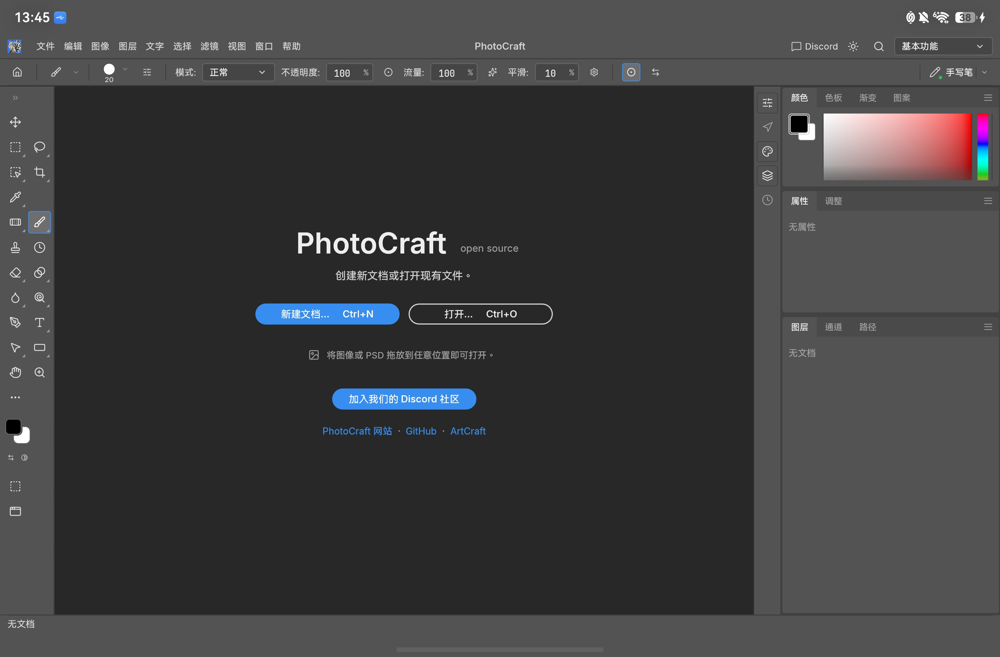
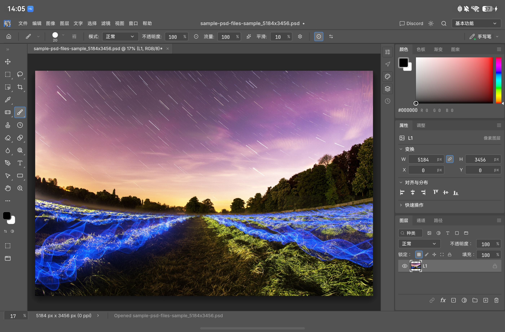

# PhotoCraft（ArkWeb 原型）

本工程把 [PhotoCraft v0.5.0](https://github.com/storytold/photocraft/releases/tag/v0.5.0) 源码封装为 HarmonyOS 6.0 / API 20 平板和 PC/2in1 应用。已在 HarmonyOS 6.0(20) 平板模拟器完成启动、绘图、File → Save／Save As 保存 PSD、PNG 导出及从本地重新打开的基本测试；PC/2in1 尚待设备验证。测试详情见 [TEST_REPORT.md](TEST_REPORT.md)。

## 运行截图





## 适配功能

文件功能适配：允许调用鸿蒙原生文件选择器DocumentViewPicker打开或保存文件，适配文件全生命周期管理。当前每次点 Save 都会再次选择保存位置，尚未记录目标文件以直接覆盖。

手写笔适配：支持Huawei M-pencil pro的压感、双击笔身切换橡皮擦、轻捏笔身显示右键菜单功能，支持设置使用手写笔时屏蔽手指输入。HarmonyOS 的 Pen Kit／InputKit 封装在独立适配器中；其他平台可接入相同协议。

## 构建和运行

使用 DevEco Studio 26.0.0.851 打开本目录，选择 `entry/default` 并构建 debug HAP。未签名包只能装模拟器；连接实机前需在 DevEco Studio 配置自己的调试签名。签名写在被 Git 忽略的根目录 `build-profile.json5`，新环境从 `build-profile.example.json5` 复制。日常开发和离线打包优先用下面的脚本，不必手写 hvigor 命令。

网页资源位于 `entry/src/main/resources/rawfile`。不带开发参数启动时，ArkWeb 把 `https://photocraft.invalid/index.html?webgl&cpu` 映射到这些打包资源，正常编辑不依赖联网。`cpu` 使用 CPU 画布，避免当前 WebGL 文档画布在绘画时又合成又上传。DevEco 直接 Run 只更新 HAP 外壳和图标，不会重新编译 `upstream/photocraft/` 里的 Rust 源码。

## 脚本

仓库自带两个 shell 脚本，都在 `scripts/`。它们按脚本自身位置找仓库根目录，当前工作目录不限。请直接执行，或用 `bash` 执行。

两个脚本都会读取 Git 忽略的 `scripts/dev.local.env`。新机器若 Trunk、hdc 或 hvigor 不在默认位置，复制 `scripts/dev.local.env.example` 为 `scripts/dev.local.env` 并填写路径。可设置的变量：

- `PHOTOCRAFT_TRUNK`：Trunk 0.21.14 可执行文件。还需要该 Trunk 所用 Rust 的 `wasm32-unknown-unknown` 目标。
- `PHOTOCRAFT_HDC`：默认 `/Applications/DevEco-Studio.app/Contents/sdk/default/openharmony/toolchains/hdc`。
- `PHOTOCRAFT_HVIGOR`：默认 `/Applications/DevEco-Studio.app/Contents/tools/hvigor/bin/hvigorw`。

运行前用 `hdc list targets` 确认只连着要安装的那一台设备。如果有模拟器在线，请断开连接。

### `scripts/dev.sh`

用当前源码实时调试。应用通过 `hdc rport` 访问电脑上的 Trunk，地址是 `http://127.0.0.1:8765/index.html?webgl&cpu`。终端和数据线都要保持连接。修改 `upstream/photocraft/` 后 Trunk 自动重建并刷新，不必重装 HAP。修改 `entry/` 里的 ArkTS 后要重新执行 `run`。第一次 Rust 构建可能要数分钟。

```bash
scripts/dev.sh run
```

编译并安装已签名的 debug HAP，启动 Trunk，映射平板的 8765 端口，再以 `photocraft.dev` 开发参数打开应用。没有已签名 HAP 时会失败。

```bash
scripts/dev.sh serve
```

只在本机启动 Trunk，不安装、不启动应用。调试 HAP 已经装好时，在另一个终端执行：

```bash
scripts/dev.sh launch
```

它补上端口映射，并强制以开发模式重新打开应用。不带 `photocraft.dev` 的普通启动，包括 DevEco 的 Run 和桌面图标，继续使用 `rawfile` 里的离线包。

### `scripts/package_offline.sh`

```bash
scripts/package_offline.sh
```

把当前源码打成可离线运行的完整版本。它编译 release 网页包，替换 `entry/src/main/resources/rawfile`，更新 `Index.ets` 里的 JS/WASM 文件名，再运行 `scripts/verify_assets.py`。默认还会打出已签名的 debug HAP。磁盘上未提交的鸿蒙源码改动会一起编进去。第一次编译可能要十几分钟。

```bash
scripts/package_offline.sh --skip-build
```

跳过 Trunk，使用已有的 `upstream/photocraft/dist/web`。目录里必须已经有一次成功的 release 构建。

```bash
scripts/package_offline.sh --install
```

打包后用 hdc 安装到当前设备。安装前关掉模拟器。若平板上已有另一套签名的同名应用，需要先卸载。

## 源码

完整的 PhotoCraft Rust 源码位于 `upstream/photocraft/`，通过未压缩历史的 Git subtree 从 v0.3.0 导入并更新到 v0.5.0，`git log v0.5.0` 可以看到上游的原始提交。仓库的 `upstream` 远程指向 `https://github.com/storytold/photocraft.git`；Git 远程配置不会随克隆传播，在新克隆中执行 `git remote add upstream https://github.com/storytold/photocraft.git` 即可继续跟踪上游。鸿蒙适配改动直接写在这份源码里，仓库不再维护单独的适配补丁文件。

`third_party/wgpu-hal-30.0.1/` 存放随仓库固定的 wgpu-hal 30.0.1 依赖源码，来自上游 gfx-rs/wgpu，随仓库提供以保证构建可复现。它带有一处 WebGL 补丁：uniform block 被着色器链接器优化掉后跳过绑定，不再解引用空索引，否则 PhotoCraft 会在模拟器 WebGL 适配器上启动失败。`upstream/photocraft/Cargo.toml` 通过 `path` 覆盖直接引用这份源码，因此该修复无需等待上游发布；只有升级 wgpu-hal 版本时，才需要重新打补丁。
