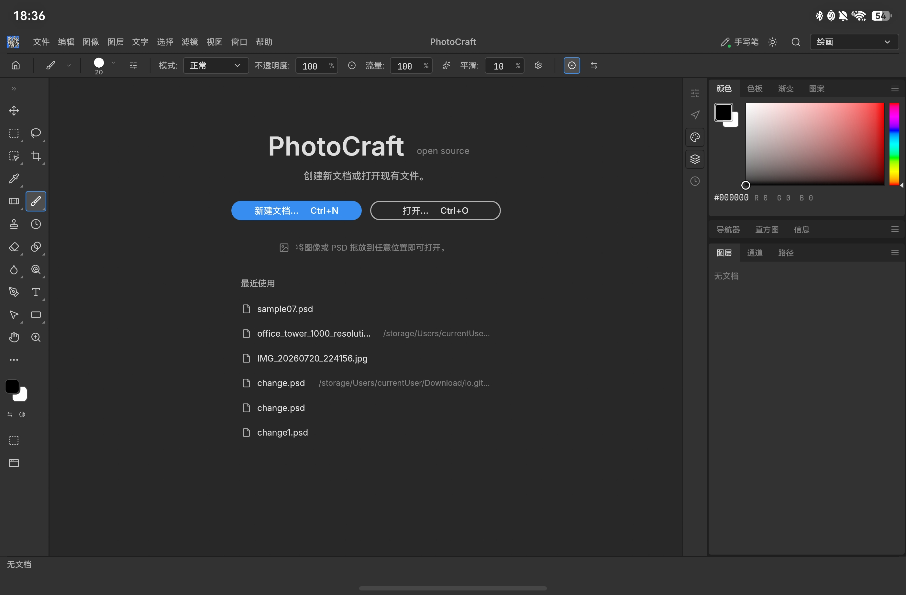
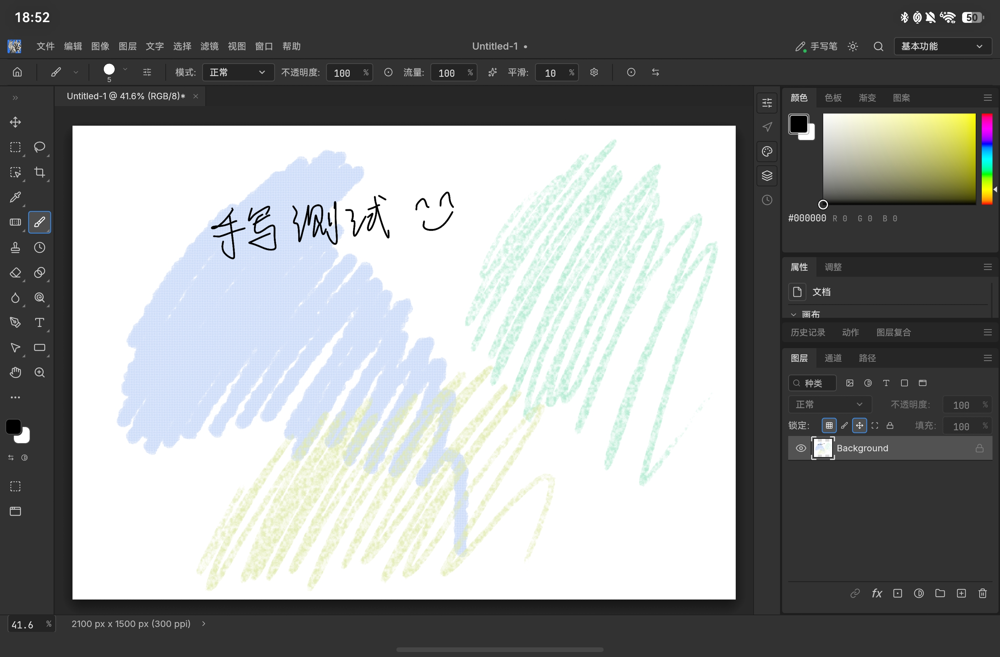
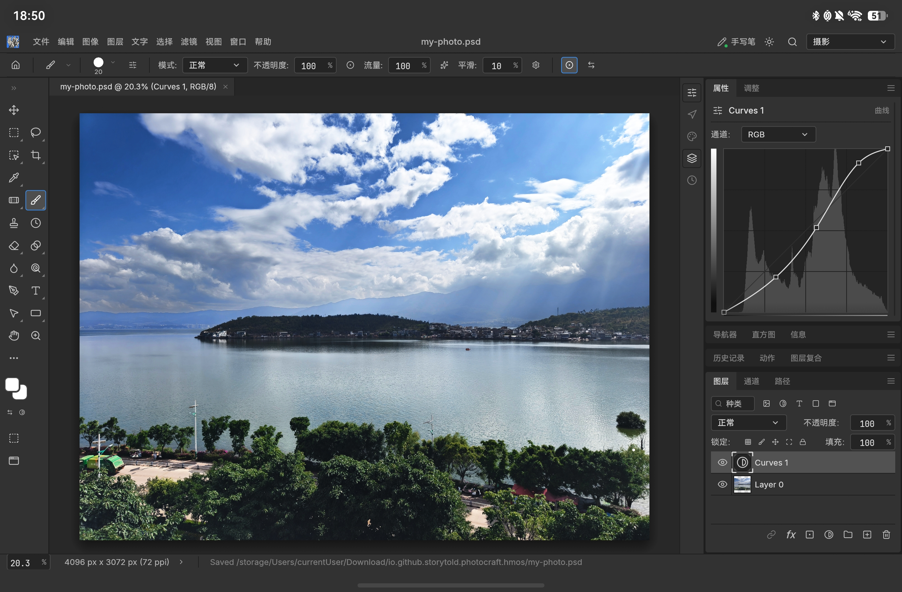
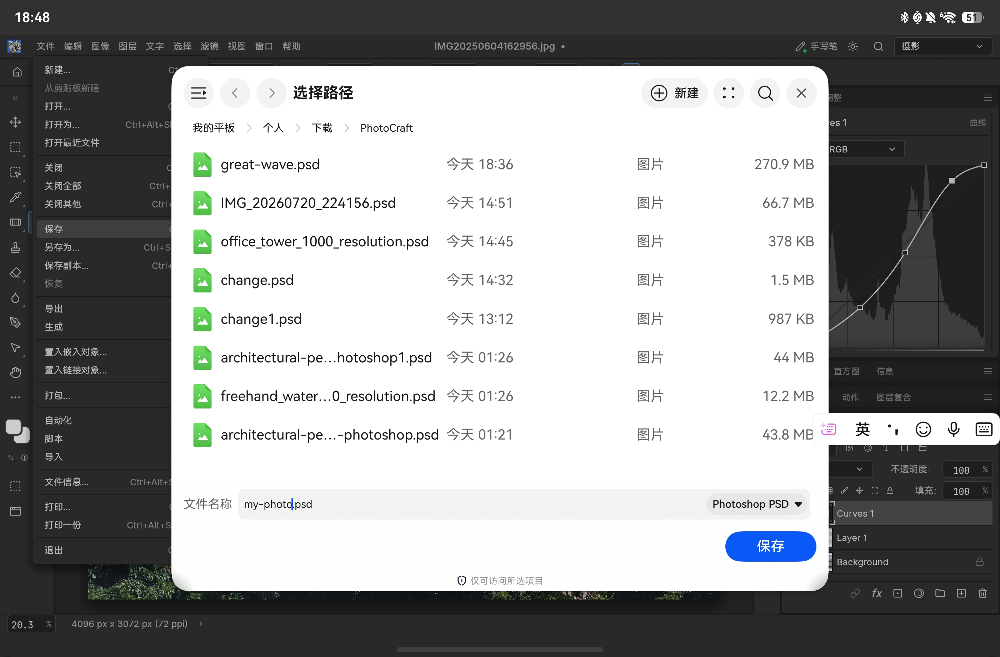

# PhotoCraft for HarmonyOS

[](https://developer.huawei.com/consumer/cn/arkts/)
[](https://www.rust-lang.org/)
[](https://www.harmonyos.com/)
[](LICENSE)
[](https://github.com/MXJinjing/photocraft-hmos)

面向 HarmonyOS 的分层图像编辑应用。

PhotoCraft 是一款开源图像编辑器，支持图层、蒙版、文字、画笔，以及 Photoshop 分层文件（PSD）。本仓库为其在 **HarmonyOS** 上的原生适配版本，界面与操作尽量贴近上游桌面版。

> [!NOTE]
> 本仓库为个人对 PhotoCraft 的鸿蒙适配，**与上游 PhotoCraft / ArtCraft 团队无关**，未获其官方支持或背书。当前仍是早期开发版本（基于上游 PhotoCraft v0.6.0），功能与稳定性仍在完善中，**请谨慎用于实际生产场景**，编辑过程中请及时保存文件内容。如遇问题，欢迎通过 Issue 反馈。

完整功能与桌面版能力说明，请参阅上游项目：[storytold/photocraft](https://github.com/storytold/photocraft) · 官网介绍：[getartcraft.com/apps/photocraft](https://getartcraft.com/apps/photocraft)

---

## 鸿蒙版额外功能

相对上游桌面 / Web 版，本仓库在 HarmonyOS 上额外提供以下适配：

- **触屏优化** — 针对手指操作调整交互与手势，支持双指平移 / 缩放，更适合平板与手机
- **华为 M-Pencil 适配** — 连接手写笔后可使用压感、双击笔身和轻捏笔身；同时支持屏蔽手指输入（具体效果因机型与笔型号而异）
- **系统色彩管理** — 协商 SDR Display P3 输出，不支持时回退到 sRGB；预览仍为 8-bit，不包含 HDR 输出

其余图层、PSD、调整、选区等能力以设备上实际表现为准；完整能力清单以上游说明为准。

---

## 运行截图

| 主界面 | 手写绘画 |
|:---:|:---:|
|  |  |
| 启动页与主界面 | 手写笔绘画 |

| 照片曲线调整 | 文件保存 |
|:---:|:---:|
|  |  |
| 曲线调整层 | 系统路径选择器保存 PSD |

---

## 安装方式

目前尚未上架华为应用市场，需自行下载安装包。请根据是否具备鸿蒙开发环境，选择对应方式：

**无 DevEco / 开发者套件（普通用户）**

1. 打开本仓库的 [Releases（发布页）](https://github.com/MXJinjing/photocraft-hmos/releases)
2. 下载最新的未签名 `.hap`（文件名格式为 `photocraft-hmos-<版本>-release-unsigned.hap`）
3. 使用「小白调试助手」签名并侧载至真机（工具项目：[likuai2010/auto-installer](https://github.com/likuai2010/auto-installer)）

**已具备 HarmonyOS 开发者套件**

无需使用小白调试助手。可从源码构建后，使用套件自带的 `hdc` 直接安装到当前连接的模拟器或设备（详见下文「从本仓库源码构建」）。

**说明：**

- 发布页安装包仅含 **arm64-v8a** 架构，无法在 x86_64 模拟器上运行；该包标注为 **unsigned（未签名）**，安装至设备前须先完成签名
- 建议系统版本为 **HarmonyOS 6.0** 及以上


---

## 已知限制

当前版本仍存在以下限制，使用前请知悉：

- 仍为早期开发版本，请谨慎用于生产环境；处理大图或复杂 PSD 时可能出现性能不足或偶发卡顿，请及时保存
- 「最近打开」尚不能可靠地直接重新打开文件（需通过系统文件选择器再次选择）
- 系统剪贴板、自动恢复草稿等能力仍在完善中
- 未签名安装包无法直接安装至真机；应用市场分发尚未提供

上游桌面版的能力对照说明，见 [parity 文档](https://github.com/storytold/photocraft/blob/main/docs/roadmap.md)。

---

## 从源码构建与安装 HAP

本节说明如何从本仓库源码构建，并用开发者套件自带的 `hdc` 安装到设备。普通用户侧载 Releases 包的方式见上文「安装方式」。

### 从本仓库源码构建（已有开发者套件）

需本机已准备好 **HarmonyOS 6.0 / API 20** 相关 SDK（如 DevEco Studio），以及可编译鸿蒙目标的 Rust 工具链。本地调试签名请在 DevEco Studio 中配置；签名材料仅保留于本机，请勿提交至仓库。

1. 克隆本仓库，进入项目目录
2. 添加鸿蒙相关 Rust 目标：

```sh
rustup target add aarch64-unknown-linux-ohos
```

3. 将 `scripts/dev.local.env.example` 复制为 `scripts/dev.local.env`，按本机路径填写 SDK、`hdc`、`hvigorw`、`ohpm` 等（该文件已被 git 忽略）
4. 构建与安装（请仅连接一台模拟器或真机）：

```sh
scripts/dev.sh build    # 编译 ARM64 原生库，并打出本地调试用 HAP
scripts/dev.sh run      # 构建后经 hdc 安装到当前唯一连接的设备并启动
scripts/dev.sh launch   # 重新启动已经装好的应用
```

`scripts/dev.sh run` 会调用 `hdc install -r` 安装本地调试签名后的 HAP（`entry/build/default/outputs/default/entry-default-signed.hap`），再通过 `hdc shell aa start` 启动应用。若已手动构建好签名包，也可自行执行：

```sh
hdc install -r entry/build/default/outputs/default/entry-default-signed.hap
hdc shell aa force-stop io.github.storytold.photocraft.hmos
hdc shell aa start -a EntryAbility -b io.github.storytold.photocraft.hmos
```

未配置本地调试签名时，脚本会提示先在 DevEco Studio 中完成签名配置。重新部署或执行 `launch` 会关闭当前窗口，请事先保存文档。更详细的原生适配与架构说明，见仓库内 [`native/README.md`](native/README.md)。

---

## 原生架构与验证

当前源码基于 PhotoCraft v0.6.0，鸿蒙版本为 `0.6.0.1`（versionCode `60001`）。PhotoCraft Rust 库通过 XComponent / NativeWindow 与 wgpu GLES/EGL 绘制 egui UI；文档画布使用 CPU 合成。HAP 包含 ARM64 原生库，上游桌面/Web 源码和完整 Git 历史随 subtree 保留。

自动显示配置文件表示应用输出空间，文档按 ICC 转换后由鸿蒙完成屏幕映射；它不代表实测面板 ICC。窗口重建、尺寸变化和 EGL surface 恢复后重新声明色彩空间。

鸿蒙帮助菜单保留指向此 fork 的 GitHub 与问题反馈，隐藏 Discord 和项目官网推广入口；关于页面保留简介、版本与技术栈。上游桌面/Web 默认界面保留原有入口。源码、构建与自动化验证记录见 [native/README.md](native/README.md) 和 [NATIVE_TEST_REPORT.md](NATIVE_TEST_REPORT.md)。

---

## 反馈与上游

- 本仓库问题与建议：[Issues](https://github.com/MXJinjing/photocraft-hmos/issues)
- 上游 PhotoCraft（桌面 / Web）：[storytold/photocraft](https://github.com/storytold/photocraft)
- ArtCraft 社区 Discord：[discord.gg/artcraft](https://discord.gg/artcraft)

构建脚本与原生层细节见 [`native/README.md`](native/README.md)；装包与侧载见上文「从源码构建与安装 HAP」。

---

## 许可与声明

本项目与上游一致，采用 [MIT](LICENSE-MIT) 或 [Apache-2.0](LICENSE-APACHE) 双许可，可任选其一（`MIT OR Apache-2.0`）。贡献默认采用相同许可。

上游版权与归属声明见 [NOTICE](upstream/photocraft/NOTICE) 和 [ATTRIBUTION.md](upstream/photocraft/ATTRIBUTION.md)。第三方代码及资源保留各自许可证；ArtCraft 品牌资源另受 [品牌许可](upstream/photocraft/docs/brand/LICENSE-brand.txt) 约束。

**本仓库是个人适配项目，与上游 PhotoCraft / ArtCraft 团队没有隶属或合作关系**，不代表其官方立场，亦不由其维护。

当前仍为早期开发版本，请勿依赖其完成重要交付；使用前请自行评估，编辑时请及时保存文件内容。

Adobe、Photoshop 等是 Adobe Inc. 的商标。PhotoCraft 是独立开源项目，与 Adobe 无关、未获其赞助或背书；文中名称仅用于说明兼容的工作流程。
